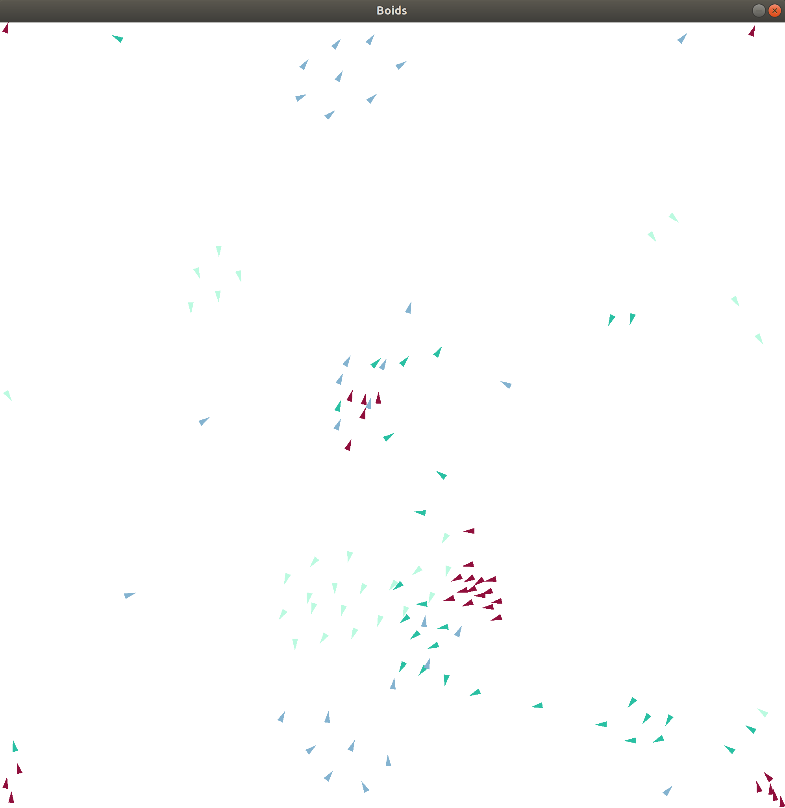

# Boids simulation 

* Setup: create a venv in your repository containing all your virtual environments, 
  
	* with venv
	
			cd YourVenvEnvironmentsRepository
			virtualenv --python=python3 NameOfYourEnvironment
  
	* or with conda
  
			conda create --name NameOfYourEnvironment
   			
     	* which will be located somewhere like /home/user/anaconda3/envs/NameOfYourEnvironment
   	
    
* Activate your virtual environment
  
	* with venv

			source *yourEnvironmentsPath*/NameOfYourEnvironment/bin/activate
  
	* or with conda 
  
			conda activate NameOfYourEnvironment

* You should see (NameOfYourEnvironment) -how you called your virtual env- at the beginning of the line in your shell. For exemple with my environment named "env2":

		(env2) ed@ed-Precision-5550:~/python-environments$ 

    
* Then, use requirements.txt file

		pip3 install -r requirements.txt
		
		
## generate data

* In simulation_data_generator.py choose mode=0, the name of the directory where the simulation data will be stored, the number of boids for each species, in accordance with constants.py file parameters, for exemple:

		mode = 0  # choose mode from 0 to 8, see behind in *main* function
		repository = "simulation_data_new/"  # where the data will be stored (in /data/*repository*)
		list_num_boids = [30, 30, 30, 30]  # number of boids for each species
		
* and then run main with these parameters.

		main(mode=mode, repository=repository, list_num_boids=list_num_boids)
		
* Data simulation will be stored in /data/*repository*
* You can, after, chose another mode to test some clustering algorithm, and specify the initial step where the clustering begin, for example:

		# choose a mode
		mode = 1  # choose mode from 0 to 8, see behind in *main* function
		repository = "simulation_data_new/"  # where the data will be stored in \data\*repository*
		list_num_boids = [30, 30, 30, 30]  # number of boids for each species
		step_to_begin = 300  # step where the rerun-simulation begin, useless for mode=0 where we begin
		# a new simulation and begin at step=0
		main(mode=mode, repository=repository, list_num_boids=list_num_boids, step_to_begin=step_to_begin)
		
* labels calculated will be stored in /data/*repository* with the method specified, for the method see ML.py file and a short description in the main function in simulation_data_generator.py

* More clustering method will be added with time
