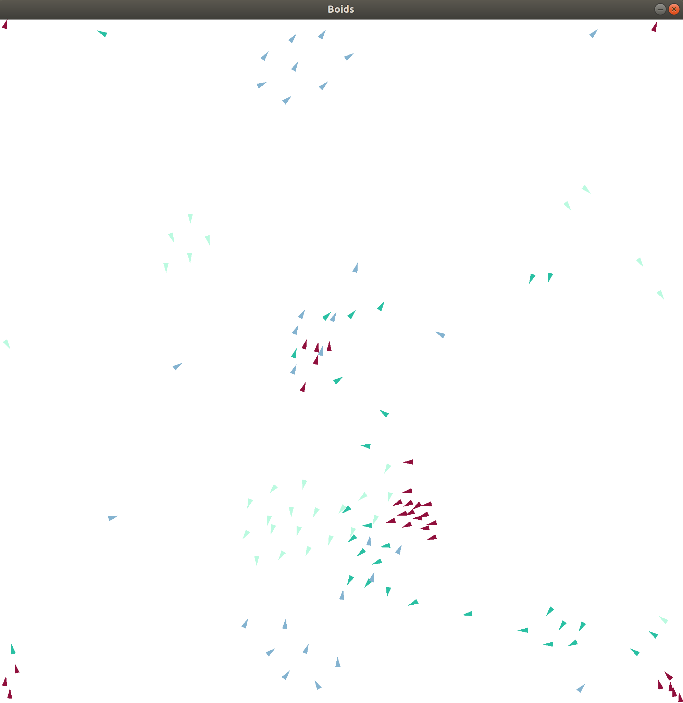

# Boids simulation 

* Clone the repository

		git clone <repo>
    
    	cd <repo>

* Setup: create a venv in your repository containing all your virtual environments, 
  
	* with venv
	
			cd YourVenvEnvironmentsRepository
			virtualenv --python=python3 NameOfYourEnvironment
  
	* or with conda
  
			conda create --name NameOfYourEnvironment
   			
     	* which will be located somewhere like /home/user/anaconda3/envs/NameOfYourEnvironment
   	
    
* Activate your virtual environment
  
	* with venv

			source *yourEnvironmentPath*/env/bin/activate
  
	* or with conda 
  
			conda activate NameOfYourEnvironment

* You should see (NameOfYourEnvironment) -how you called your virtual env- at the beginning of the line in your shell. For exemple with my environment named "env2":

		(env2) ed@ed-Precision-5550:~/python-environments$ 

    
* Then, use requirements.txt file

		pip3 install -r requirements.txt
 
* You can now watch Boids 
